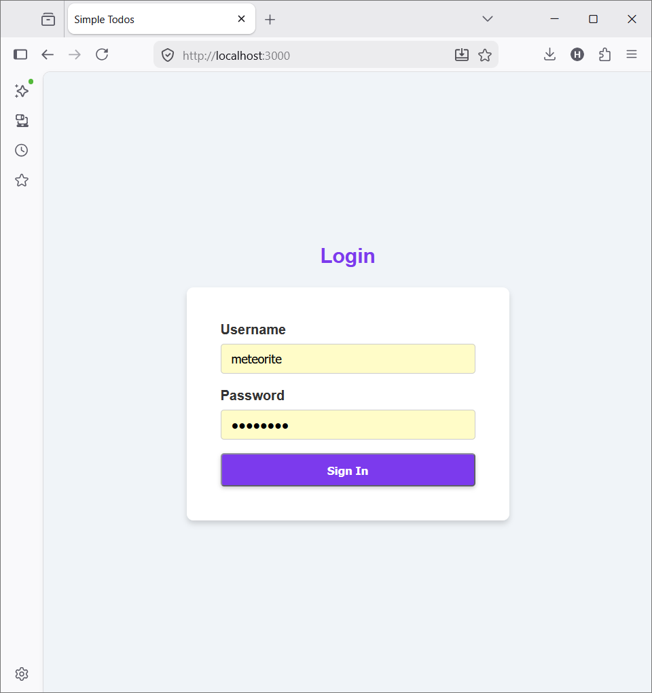
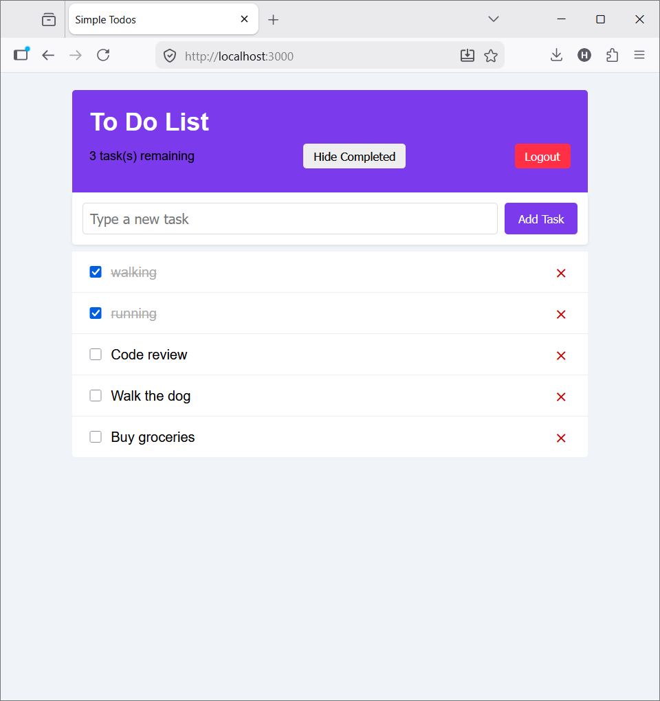
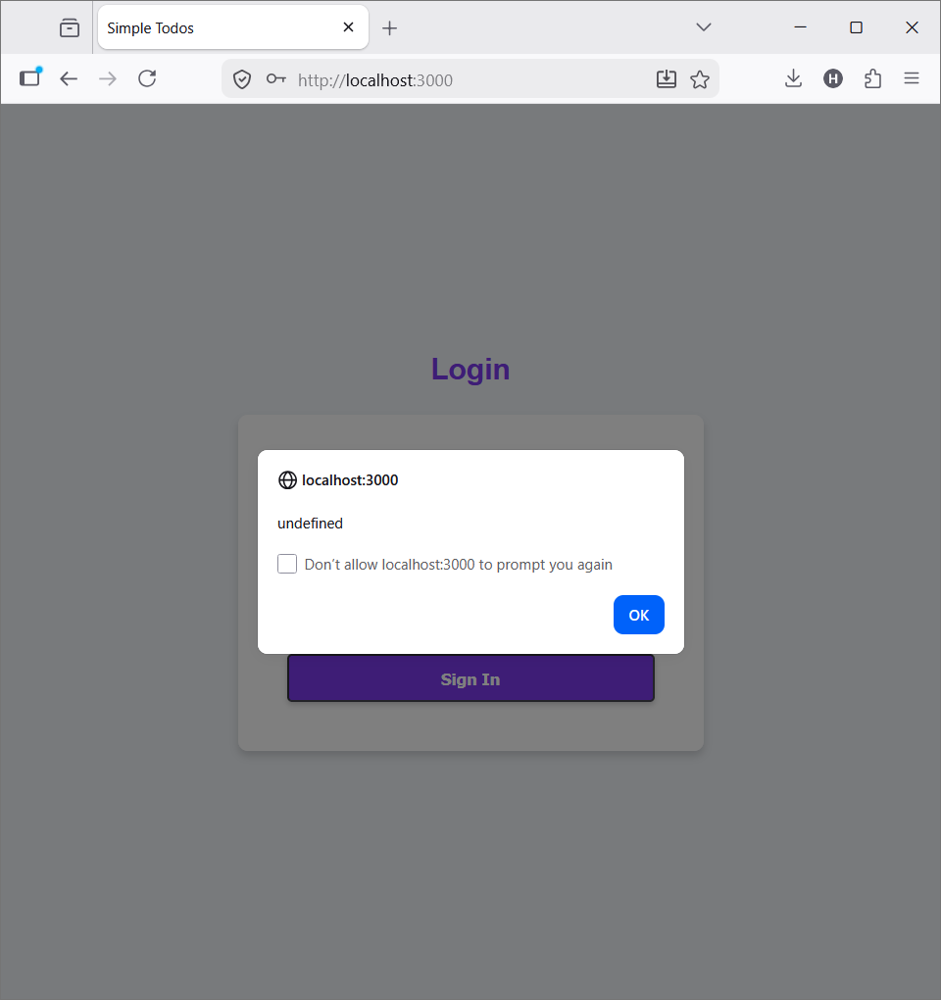
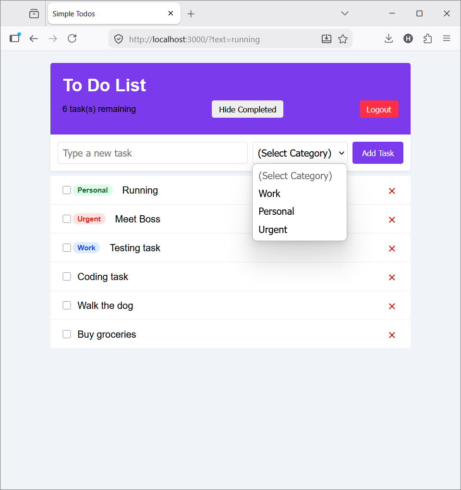
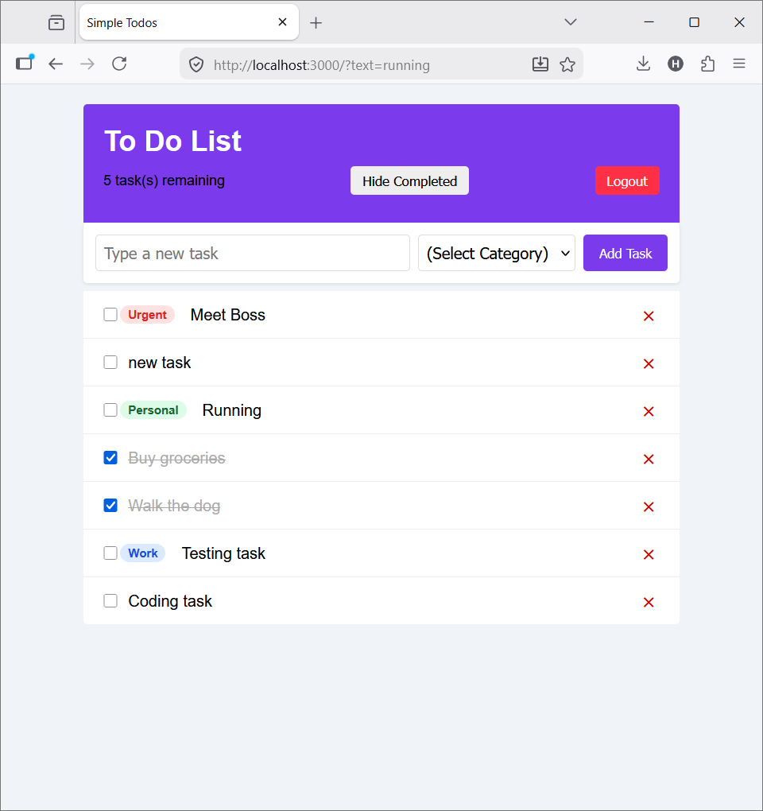

# Simple Todos — Meteor Blaze
### A full-stack todo application built with Meteor 3.4.1 and Blaze

This full-stack application allows users to create, toggle, and manage their personal to-do list with real-time updates. The project follows the official Meteor Blaze tutorial and extends it with two custom enhancements: Task Categories and Drag-and-Drop Reordering. It includes secure data mutations, private publications, and custom category badges.

## Features
- Task creation, completion toggle, and deletion
- Task filtering: hide/show completed tasks with live pending count
- User authentication: login and logout with accounts-password
- Secure Meteor Methods (no direct client DB writes)
- Private data via Meteor Publications (users only see their own tasks)
- Task Categories: Work, Personal, Urgent with color-coded badges
- Drag-and-drop reordering with order persisted in MongoDB

## Tech Stack

| Technology | Version | Purpose |
| :--- | :--- | :--- |
| Meteor | 3.4.1 | Full-stack application framework |
| MongoDB | Built-in | Document database for task persistence |
| Blaze | Built-in | Reactive HTML templating engine |
| SortableJS | Latest (1.15.x) | Drag-and-drop list reordering library |
| accounts-password | Built-in Meteor Package | Password-based user authentication |
| reactive-dict | Built-in Meteor Package | Client-side reactive state dictionary |

## Getting Started

Follow these steps to set up and run the project locally.

### Prerequisites
- Node.js 20+
- Meteor 3.x

### Installation
1. Clone the repository:
   ```bash
   git clone https://github.com/holikaradhakrishna-spec/meteor-blaze-todo-app.git
   ```
2. Navigate to the project directory:
   ```bash
   cd meteor-blaze-todo-app
   ```
3. Install dependencies:
   ```bash
   meteor npm install
   ```
4. Start the application:
   ```bash
   meteor
   ```
5. Open your browser and navigate to:
   ```
   http://localhost:3000
   ```
6. Log in with the pre-seeded account:
   - **Username**: `meteorite`
   - **Password**: `password`

## Screenshots







## Project Structure

```
meteor-blaze-todo-app/
├── client/           # Browser entry point and CSS
├── server/           # Server entry, seeding
├── imports/
│   ├── api/          # Collection, Methods, Publications
│   └── ui/           # Blaze templates and JS
└── .meteor/          # Meteor internals
```

## Implementation Notes

To secure the application, we removed the `insecure` package and routed all database mutations (task insert, delete, toggle completion, and reorder) through server-side Meteor Methods, incorporating proper user authentication checks. We also removed the `autopublish` package and introduced a subscription to a custom `tasks` publication, ensuring that users can only fetch their own tasks from MongoDB. Task reordering is managed on the client using SortableJS and is persisted in the database by updating the `order` attribute of each task document via the `tasks.updateOrder` method.

## Future Improvements
- Due dates with visual alerts
- Search filter for task titles and categories
- Task archiving instead of deletion
- Multi-list support (e.g., shopping list, work tasks)

